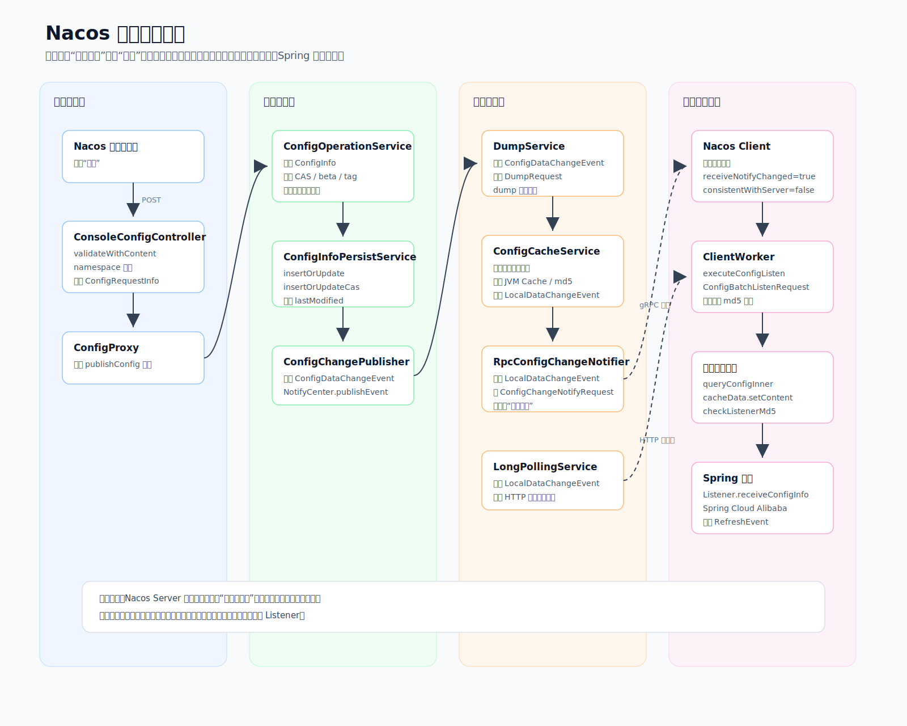
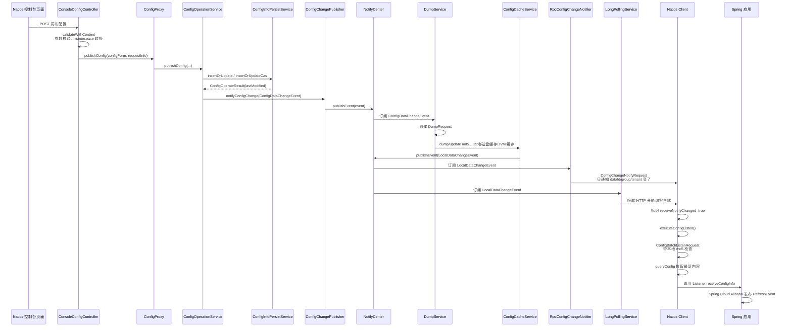

# Nacos 配置发布流程

这张图描述的是：在 Nacos 控制台“编辑配置”页面点击“发布”之后，从控制台请求、服务端保存配置、发布变更事件，到客户端收到通知并拉取最新配置的一系列流程。

如果当前 Markdown 工具不支持 Mermaid，可以直接打开 SVG 图片版：

## 关键源码入口

- `/Users/liminjie/Documents/myPrjs/nacos/console/src/main/java/com/alibaba/nacos/console/controller/v3/config/ConsoleConfigController.java`
- `/Users/liminjie/Documents/myPrjs/nacos/console/src/main/java/com/alibaba/nacos/console/proxy/config/ConfigProxy.java`
- `/Users/liminjie/Documents/myPrjs/nacos/config/src/main/java/com/alibaba/nacos/config/server/service/ConfigOperationService.java`
- `/Users/liminjie/Documents/myPrjs/nacos/config/src/main/java/com/alibaba/nacos/config/server/service/ConfigChangePublisher.java`
- `/Users/liminjie/Documents/myPrjs/nacos/config/src/main/java/com/alibaba/nacos/config/server/service/dump/DumpService.java`
- `/Users/liminjie/Documents/myPrjs/nacos/config/src/main/java/com/alibaba/nacos/config/server/service/ConfigCacheService.java`
- `/Users/liminjie/Documents/myPrjs/nacos/config/src/main/java/com/alibaba/nacos/config/server/remote/RpcConfigChangeNotifier.java`
- `/Users/liminjie/Documents/myPrjs/nacos/config/src/main/java/com/alibaba/nacos/config/server/service/LongPollingService.java`
- `/Users/liminjie/Documents/myPrjs/nacos/client/src/main/java/com/alibaba/nacos/client/config/impl/ClientWorker.java`
- `/Users/liminjie/Documents/myPrjs/nacos/client/src/main/java/com/alibaba/nacos/client/config/impl/CacheData.java`

## 核心结论

Nacos Server 推给客户端的是“配置已变更”的通知，不是完整配置内容。客户端收到通知后，会再通过查询配置接口拉取最新内容，然后触发本地 listener。
